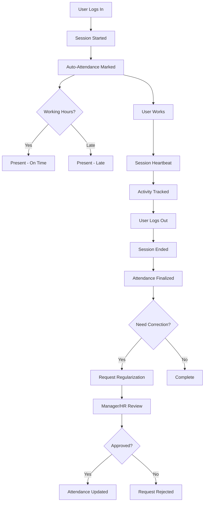
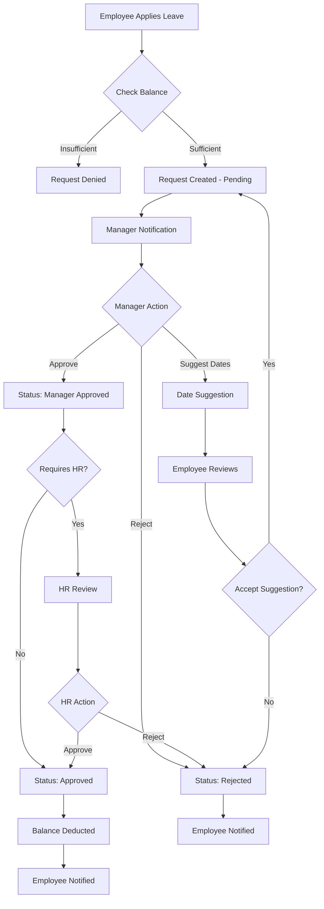
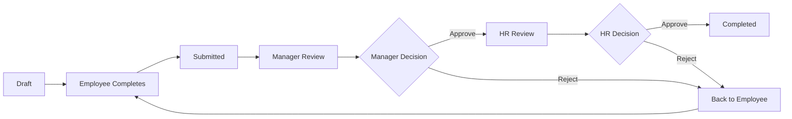
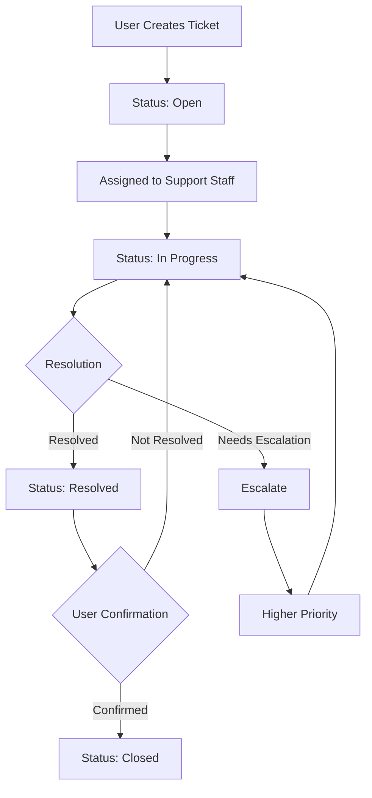
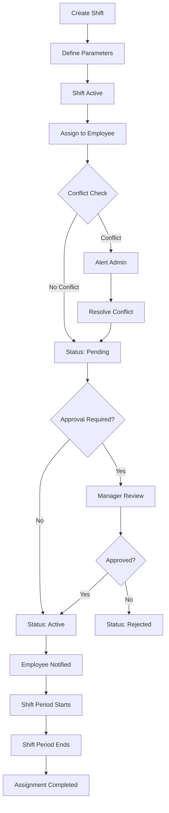
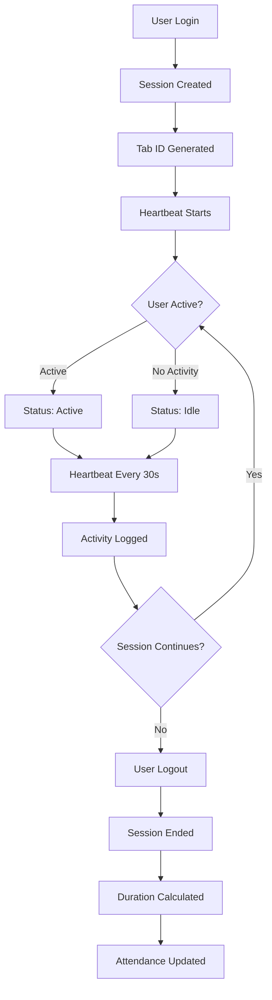
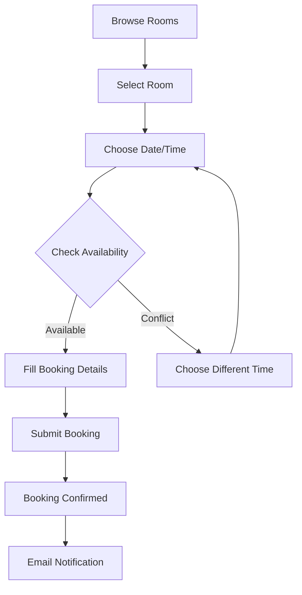
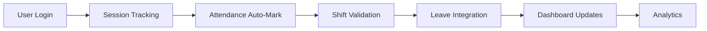

# TrueAlign - Comprehensive System Documentation

## Executive Summary

**TrueAlign** is a comprehensive Enterprise Resource Planning (ERP) system specifically designed for HR and workforce management. The system provides end-to-end solutions for employee management, attendance tracking, leave management, performance appraisals, support ticketing, shift management, session tracking, and more.

---

## Table of Contents

1. [Core Module](#1-core-module)
2. [Attendance Management Module](#2-attendance-management-module)
3. [Leave Management Module](#3-leave-management-module)
4. [Appraisal Module](#4-appraisal-module)
5. [Support Ticket Module](#5-support-ticket-module)
6. [Shift Management Module](#6-shift-management-module)
7. [Session Tracking Module](#7-session-tracking-module)
8. [Conference Room Booking Module](#8-conference-room-booking-module)
9. [Finance Management Module](#9-finance-management-module)
10. [Letter Generation Module](#10-letter-generation-module)
11. [Global Updates/Notes Module](#11-global-updates-notes-module)
12. [Notifications Module](#12-notifications-module)
13. [Profile & User Management Module](#13-profile--user-management-module)
14. [System Architecture](#14-system-architecture)
15. [User Roles & Permissions](#15-user-roles--permissions)
16. [Workflows](#16-workflows)

---

## 1. Core Module

The Core module provides the foundation for the entire TrueAlign system, handling authentication, user management, session tracking, and system configuration.

### 1.1 Features

#### Authentication & Authorization
- **User Login/Logout** - Secure authentication with session management
- **Password Reset** - Direct password reset without email verification
- **Session-based Access Control** - Role-based access control (RBAC)

#### Session Management (Optimized)
- **Real-time Session Heartbeat** - Tracks user activity in real-time
- **Batch Activity Updates** - Efficiently processes user activities
- **Session Status Monitoring** - Live monitoring of active/idle/ended sessions
- **Force Synchronization** - Manual sync of buffered session data
- **Session Analytics** - Comprehensive session analytics and reporting
- **Bulk Session Updates** - Process multiple session updates in transactions

#### Dashboard
- **Unified Dashboard** - Centralized view of all system metrics
- **Real-time Statistics** - Live data updates for active sessions
- **Quick Actions** - Fast access to common tasks
- **Personalized Widgets** - Role-based widget display

#### Office Location Management
- **Location CRUD Operations** - Create, view, edit, delete office locations
- **Geographic Data** - Address, city, state, country tracking
- **Working Hours** - Define working hours per location
- **Time Zone Support** - Multi-timezone support for global offices

### 1.2 URL Endpoints

| **Endpoint** | **View Function** | **Description** |
|------------|------------------|-----------------|
| `/` | `home_view` | Home page (redirects to dashboard if authenticated) |
| `/login/` | `login_view` | User login |
| `/logout/` | `logout_view` | User logout with session cleanup |
| `/password-reset/` | `CustomPasswordResetView` | Direct password reset |
| `/password-reset/done/` | `CustomPasswordResetDoneView` | Password reset confirmation |
| `/password-reset/confirm/<uidb64>/<token>/` | `CustomPasswordResetConfirmView` | Password reset link |
| `/password-reset/complete/` | `CustomPasswordResetCompleteView` | Password reset complete |
| `/dashboard/` | `dashboard_view` | Main dashboard with session analytics |
| `/api/dashboard-stats/` | `dashboard_stats_api` | API for dashboard statistics |
| `/configurations/` | `configurations_view` | System configurations |
| `/session/heartbeat/` | `optimized_session_heartbeat` | Session heartbeat endpoint |
| `/optimized-heartbeat/` | `optimized_session_heartbeat` | Optimized heartbeat |
| `/optimized-batch-activity/` | `optimized_batch_activity_update` | Batch activity updates |
| `/optimized-session-status/` | `optimized_session_status` | Get session status |
| `/optimized-end-session/` | `optimized_end_session` | End current session |
| `/optimized-force-sync/` | `optimized_force_sync` | Force sync buffered data |
| `/optimized-session-analytics/` | `optimized_session_analytics` | Session analytics |
| `/optimized-bulk-update/` | `optimized_bulk_session_update` | Bulk session update |
| `/api/session/create/` | `create_session` | Create new session |
| `/api/session/update/` | `update_session` | Update session |
| `/locations/` | `manage_locations` | Manage office locations |
| `/locations/add/` | `add_location` | Add new location |
| `/locations/edit/<id>/` | `edit_location` | Edit location |
| `/locations/delete/<id>/` | `delete_location` | Delete location |

### 1.3 Core Signals

The system uses Django signals for automated workflows:

- **`handle_user_login`** - Initialize session on login
- **`handle_user_logout`** - Cleanup sessions on logout
- **`handle_session_save`** - Cache invalidation on session updates
- **`handle_session_delete`** - Cleanup related data on session deletion
- **`handle_user_update`** - Update user-related caches
- **`cleanup_old_sessions`** - Automated cleanup of old sessions
- **`cleanup_inactive_sessions`** - Remove inactive sessions
- **`handle_suspicious_activity`** - Security monitoring

---

## 2. Attendance Management Module

Comprehensive attendance tracking system with auto-marking, regularization requests, and detailed analytics.

### 2.1 Features

#### Employee Features
- **Attendance Dashboard** - Personal attendance overview with calendar
- **Attendance Calendar** - Monthly/yearly calendar view
- **Regularization Requests** - Request corrections for attendance records
- **Attendance Auto-Marking** - Automatic attendance marking based on sessions
- **Session Integration** - Seamless integration with session tracking

#### Manager Features
- **Team Overview** - View team attendance at a glance
- **Approval Workflows** - Approve/reject regularization requests
- **Team Analytics** - Attendance patterns and insights

#### HR Features
- **HR Dashboard** - Comprehensive attendance metrics
  - Total present employees
  - Absent employees today
  - Late arrivals
  - Employees on leave
  - Attendance trends
- **Regularization Request Management** - Review and process requests
- **Manual Attendance Entry** - Add/edit attendance records
- **Bulk Operations** - Mass attendance updates
- **Attendance Cleanup** - Remove duplicate/invalid records
- **Advanced Analytics** - Detailed reports and visualizations

#### Reporting
- **Custom Reports** - Generate filtered attendance reports
- **CSV Export** - Download attendance data
- **Search Functionality** - Search attendance records
- **Monthly Statistics** - Aggregate monthly data

#### API Endpoints
- **Real-time Data** - JSON APIs for attendance data
- **Monthly Data** - Aggregated monthly statistics
- **Auto-marking Trigger** - Manual trigger for auto-marking
- **Session Status Verification** - Verify session-attendance integration
- **Activity Updates** - Track user activity
- **Optimized Heartbeat** - Performance-optimized session tracking
- **Batch Activity Processing** - Efficient bulk updates

### 2.2 URL Endpoints

| **Endpoint** | **View Function** | **Description** |
|------------|------------------|-----------------|
| `/attendance/` | `attendance_dashboard` | Employee dashboard |
| `/attendance/calendar/` | `attendance_calendar` | Calendar view (current month) |
| `/attendance/calendar/<year>/<month>/` | `attendance_calendar` | Calendar for specific month |
| `/attendance/request-regularization/` | `request_regularization` | Request attendance correction |
| `/attendance/request-regularization/<id>/` | `request_regularization` | Request for specific attendance |
| `/attendance/manager/overview/` | `manager_attendance_overview` | Manager team overview |
| `/attendance/hr/dashboard/` | `hr_attendance_dashboard` | HR dashboard |
| `/attendance/hr/regularization-requests/` | `hr_regularization_requests` | HR regularization queue |
| `/attendance/hr/process-regularization/<id>/` | `process_regularization` | Process regularization |
| `/attendance/hr/add-attendance/` | `hr_add_attendance` | Manual attendance entry |
| `/attendance/hr/bulk-operations/` | `bulk_attendance_operations` | Bulk operations |
| `/attendance/hr/analytics/` | `attendance_analytics` | Advanced analytics |
| `/attendance/hr/cleanup/` | `attendance_cleanup` | Cleanup tool |
| `/attendance/report/` | `attendance_report` | Generate reports |
| `/attendance/export/csv/` | `export_attendance_csv` | CSV export |
| `/attendance/search/` | `search_attendance` | Search records |
| `/attendance/api/attendance-data/` | `get_attendance_data` | API: attendance data |
| `/attendance/api/monthly-data/` | `get_monthly_attendance_data` | API: monthly data |
| `/attendance/api/run-auto-marking/` | `run_auto_marking` | API: trigger auto-marking |
| `/attendance/api/summary/` | `attendance_summary_api` | API: summary stats |
| `/attendance/api/verify-session-status/` | `verify_session_status` | API: verify session |
| `/attendance/api/update-activity/` | `update_activity` | API: update activity |
| `/attendance/optimized-heartbeat/` | `optimized_heartbeat` | Optimized heartbeat |
| `/attendance/optimized-batch-activity/` | `optimized_batch_activity` | Optimized batch updates |

### 2.3 Attendance Workflow

---

## 3. Leave Management Module

Comprehensive leave management system with policy-based allocations, approval workflows, and analytics.

### 3.1 Features

#### Employee Features
- **Employee Dashboard** - Personal leave overview
  - Available leave balances by type
  - Pending leave requests
  - Leave history
  - Upcoming leaves
- **Apply for Leave** - Submit leave requests
- **Update Leave Requests** - Edit pending requests
- **View Leave Details** - Detailed view of leave status
- **My Leaves** - Personal leave history with filters
  - Filter by status (Pending, Approved, Rejected, Cancelled)
  - Filter by leave type
  - Search functionality
- **Comp-Off Applications** - Request compensatory off

#### Manager Features
- **Manager Dashboard** - Team leave overview
  - Pending approvals
  - Team on leave today
  - Upcoming team leaves
- **Team Leaves View** - Comprehensive team leave calendar
- **Leave Approvals** - Approve/reject leave requests
- **Date Suggestions** - Suggest alternative dates
- **Leave Cancellation** - Cancel approved leaves

#### HR Features
- **HR Dashboard** - Organization-wide leave metrics
  - All pending requests
  - Department-wise breakdown
  - Leave trends
- **Leave Type Management** - Define leave types
  - Annual Leave, Sick Leave, Casual Leave, etc.
  - Carryover policies
  - Maximum limits
- **Leave Policy Management** - Define leave policies
  - Rules and eligibility
  - Accrual rates
  - Proration rules
- **Leave Allocation** - Allocate leaves to employees
  - Bulk allocation
  - Individual allocation
  - Year-wise allocation
- **Balance Adjustments** - Manual balance corrections
- **Comp-Off Management** - Approve/reject comp-off requests

#### Admin Features
- **Admin Dashboard** - Complete system overview
- **System-wide Settings** - Configure leave system
- **Policy Creation** - Advanced policy management
- **Analytics Dashboard** - Visual analytics
  - Leave utilization trends
  - Department comparisons
  - Leave type distribution
  - Forecast analysis

#### Advanced Features
- **Leave Analytics** - Interactive charts and graphs
- **API Endpoints** - JSON data for dashboards
- **Event System** - Real-time notifications
  - Leave approved
  - Leave rejected
  - Leave cancelled
  - Date suggestions

### 3.2 URL Endpoints

| **Endpoint** | **View Function** | **Description** |
|------------|------------------|-----------------|
| `/leave/employee/` | `EmployeeDashboardView` | Employee dashboard |
| `/leave/manager/` | `ManagerDashboardView` | Manager dashboard |
| `/leave/hr/` | `HRDashboardView` | HR dashboard |
| `/leave/admin/` | `AdminDashboardView` | Admin dashboard |
| `/leave/apply/` | `LeaveApplyView` | Apply for leave |
| `/leave/request/<pk>/` | `LeaveDetailView` | Leave request details |
| `/leave/request/<pk>/edit/` | `LeaveUpdateView` | Edit leave request |
| `/leave/request/<pk>/action/` | `LeaveActionView` | Take action (approve/reject/cancel) |
| `/leave/my-leaves/` | `MyLeavesView` | Personal leave history |
| `/leave/team-leaves/` | `TeamLeavesView` | Team leaves (managers) |
| `/leave/comp-off/apply/` | `CompOffApplyView` | Apply for comp-off |
| `/leave/comp-off/<pk>/action/` | `CompOffActionView` | Comp-off action |
| `/leave/types/` | `LeaveTypeListView` | List leave types |
| `/leave/types/create/` | `LeaveTypeCreateView` | Create leave type |
| `/leave/types/<pk>/edit/` | `LeaveTypeUpdateView` | Edit leave type |
| `/leave/policies/` | `LeavePolicyListView` | List policies |
| `/leave/policies/create/` | `LeavePolicyCreateView` | Create policy |
| `/leave/policies/<pk>/edit/` | `LeavePolicyUpdateView` | Edit policy |
| `/leave/allocation/create/` | `LeaveAllocationCreateView` | Create allocation |
| `/leave/balance/adjust/` | `ManualBalanceAdjustmentView` | Adjust balance |
| `/leave/analytics/` | `LeaveAnalyticsView` | Analytics dashboard |
| `/leave/api/analytics-data/` | `LeaveAnalyticsDataView` | API: analytics data |

### 3.3 Leave Request Workflow

---

## 4. Appraisal Module

Performance appraisal management system with multi-level review workflows.

### 4.1 Features

#### Employee Features
- **Appraisal List** - View all appraisals assigned to employee
- **Create Self-Appraisal** - Complete self-assessment
- **Update Appraisal** - Edit draft appraisals
- **Submit for Review** - Submit completed appraisal
- **View Details** - See appraisal details and feedback
- **Attachment Support** - Upload supporting documents

#### Manager Features
- **Manager Dashboard** - Pending reviews and team appraisals
- **Review Appraisals** - Provide manager feedback
- **Approve/Reject** - Take action on appraisals
- **Rating System** - Rate employees on various parameters
- **Comments** - Add detailed feedback

#### HR Features
- **HR Dashboard** - Organization-wide appraisal status
- **Final Review** - HR-level review and approval
- **Appraisal Export** - Export data to CSV
- **Analytics** - Appraisal trends and insights
- **Bulk Operations** - Mass appraisal management

#### Appraisal Components
- **Appraisal Items** - Multiple assessment criteria
- **Rating Scale** - Configurable rating system
- **Attachments** - Document upload support
- **Workflow States** - Draft → Submitted → Manager Review → HR Review → Completed
- **Audit Trail** - Complete workflow history

### 4.2 URL Endpoints

| **Endpoint** | **View Function** | **Description** |
|------------|------------------|-----------------|
| `/appraisal/` | `appraisal_list` | List appraisals |
| `/appraisal/dashboard/` | `appraisal_dashboard` | Manager/HR dashboard |
| `/appraisal/export/` | `appraisal_export` | Export to CSV (HR only) |
| `/appraisal/create/` | `appraisal_create` | Create new appraisal |
| `/appraisal/<pk>/` | `appraisal_detail` | View appraisal details |
| `/appraisal/<pk>/update/` | `appraisal_update` | Update appraisal |
| `/appraisal/<pk>/submit/` | `appraisal_submit` | Submit for review |
| `/appraisal/<pk>/review/` | `appraisal_review` | Review appraisal (Manager/HR) |

### 4.3 Appraisal Workflow

---

## 5. Support Ticket Module

IT help desk and support ticket management system.

### 5.1 Features

#### All Users
- **Create Tickets** - Submit support requests
- **View My Tickets** - Personal ticket history
- **Add Comments** - Communicate on tickets
- **Upload Attachments** - Attach files to tickets
- **Real-time Updates** - Live ticket status updates

#### Support Staff (HR/Admin)
- **Support Dashboard** - All tickets overview
  - Open tickets count
  - In-progress tickets
  - Resolved tickets
  - Average resolution time
- **Ticket Assignment** - Assign tickets to staff
- **Status Management** - Update ticket status
  - Open → In Progress → Resolved → Closed
- **Priority Management** - Set/update priority (Low, Medium, High, Critical)
- **Ticket Escalation** - Escalate critical issues
- **Reassignment** - Transfer tickets between staff
- **Bulk Operations** - Mass ticket updates

#### Advanced Features
- **Search & Filter** - Find tickets quickly
- **AJAX Statistics** - Real-time dashboard updates
- **Category Management** - Organize by ticket category
- **SLA Tracking** - Monitor response times
- **Access Control** - Role-based ticket visibility

### 5.2 URL Endpoints

| **Endpoint** | **View Function** | **Description** |
|------------|------------------|-----------------|
| `/support/` | `SupportDashboardView` | Main support dashboard |
| `/support/create/` | `TicketCreateView` | Create new ticket |
| `/support/ticket/<ticket_id>/` | `TicketDetailView` | View ticket details |
| `/support/my-tickets/` | `my_tickets` | My tickets list |
| `/support/ticket/<ticket_id>/update-status/` | `update_ticket_status` | Update status |
| `/support/ticket/<ticket_id>/reassign/` | `reassign_ticket` | Reassign ticket |
| `/support/ticket/<ticket_id>/comment/` | `add_comment` | Add comment |
| `/support/ticket/<ticket_id>/attachment/` | `add_attachment` | Add attachment |
| `/support/ticket/<ticket_id>/escalate/` | `escalate_ticket` | Escalate ticket |
| `/support/ajax/stats/` | `ajax_ticket_stats` | AJAX: ticket statistics |
| `/support/ajax/search/` | `ajax_search_tickets` | AJAX: search tickets |

### 5.3 Ticket Workflow

---

## 6. Shift Management Module

Comprehensive shift scheduling and assignment management system.

### 6.1 Features

#### Shift Master Management
- **Shift Dashboard** - Overview of all shifts and assignments
  - Active shifts count
  - Total assignments
  - Pending approvals
  - Conflict alerts
- **Create Shifts** - Define shift schedules
  - Shift name and description
  - Start and end times
  - Shift types (Morning, Evening, Night, Custom)
  - Grace period settings
- **Edit/Delete Shifts** - Modify or remove shifts
- **Duplicate Shifts** - Clone existing shifts
- **Shift Details** - View shift information and assignments
- **Shift Utilization Reports** - Analyze shift usage

#### Shift Assignment Management
- **Assignment List** - View all shift assignments
- **Create Assignments** - Assign shifts to employees
  - Individual assignment
  - Date range selection
  - Conflict detection
- **Bulk Assignment** - Assign shifts to multiple employees
  - CSV upload support
  - Validation and conflict checking
- **Assignment Details** - View assignment information
- **Approve/Reject Assignments** - Workflow approvals
- **End Assignment** - Terminate ongoing assignments
- **Reassign** - Transfer assignments to different shifts
- **Assignment History** - View employee shift history

#### Conflict Management
- **Conflict Detection** - Automatic overlap detection
  - Time overlap conflicts
  - Location conflicts
  - Availability conflicts
- **Conflict List** - View all detected conflicts
- **Conflict Resolution** - Resolve conflicts manually
- **Conflict Statistics** - Analytics on conflicts

#### Calendar & Reporting
- **Calendar View** - Visual shift calendar
- **Team Assignments** - View team schedule
- **Utilization Reports** - Shift utilization metrics
- **Assignment Reports** - Generate comprehensive reports
  - Filter by user, shift, date range
  - Export to CSV/PDF

#### API Endpoints
- **API: Shifts List** - JSON endpoint for shifts
- **API: Assignments List** - JSON endpoint for assignments
- **API: Dashboard Stats** - Real-time statistics
- **API: Current Assignments** - Active assignments
- **API: Conflict Data** - Conflict information

### 6.2 URL Endpoints

| **Endpoint** | **View Function** | **Description** |
|------------|------------------|-----------------|
| `/shift/` | `dashboard` | Shift management dashboard |
| `/shift/shifts/` | `shift_list` | List all shifts |
| `/shift/shifts/create/` | `shift_create` | Create new shift |
| `/shift/shifts/<pk>/` | `shift_detail` | Shift details |
| `/shift/shifts/<pk>/edit/` | `shift_edit` | Edit shift |
| `/shift/shifts/<pk>/delete/` | `shift_delete` | Delete shift |
| `/shift/assignments/` | `assignment_list` | List assignments |
| `/shift/assignments/create/` | `assignment_create` | Create assignment |
| `/shift/assignments/bulk-create/` | `bulk_assignment_create` | Bulk assignment |
| `/shift/assignments/<pk>/` | `assignment_detail` | Assignment details |
| `/shift/assignments/<pk>/approve/` | `assignment_approve` | Approve assignment |
| `/shift/assignments/<pk>/reject/` | `assignment_reject` | Reject assignment |
| `/shift/assignments/<pk>/end/` | `assignment_end` | End assignment |
| `/shift/conflicts/` | `conflict_list` | List conflicts |
| `/shift/calendar/` | `calendar_view` | Calendar view |
| `/shift/team-assignments/` | `team_assignments_view` | Team assignments |
| `/shift/reports/utilization/` | `utilization_reports_view` | Utilization reports |
| `/shift/api/shifts/` | `api_shifts_list` | API: shifts list |
| `/shift/api/assignments/` | `api_assignments_list` | API: assignments list |
| `/shift/api/dashboard-stats/` | `api_dashboard_stats` | API: dashboard stats |
| `/shift/api/conflicts/<conflict_id>/resolve/` | `resolve_conflict` | API: resolve conflict |
| `/shift/api/assignments/history/<user_id>/` | `assignment_history` | API: user history |
| `/shift/api/assignments/current/` | `current_assignments_api` | API: current assignments |
| `/shift/api/shifts/<shift_id>/utilization/` | `shift_utilization_report` | API: shift utilization |
| `/shift/api/shifts/<shift_id>/duplicate/` | `duplicate_shift` | API: duplicate shift |
| `/shift/api/assignments/<assignment_id>/reassign/` | `reassign_assignment` | API: reassign |
| `/shift/api/reports/assignments/` | `assignment_report` | API: assignment report |
| `/shift/api/conflicts/statistics/` | `conflict_statistics` | API: conflict stats |

### 6.3 Shift Assignment Workflow

---

## 7. Session Tracking Module

Advanced user session monitoring and activity tracking system.

### 7.1 Features

#### Session Dashboard
- **Real-time Monitoring** - Live session tracking
  - Active sessions count
  - Idle sessions count
  - Total duration (daily/weekly/monthly)
  - Average session duration
- **Hourly Activity Charts** - Visualize activity patterns
- **Office Distribution** - Sessions by location
- **Device Statistics** - Device type breakdown
- **Top Users** - Most active users with shift information
- **Dynamic Filtering** - Filter by office, date range, user

#### Session Management
- **Session List** - View all sessions
  - Group by user and date
  - Real-time status updates
  - Duration tracking
- **Session Detail** - Detailed session information
  - Start/end times
  - IP address and location
  - Device information
  - Activity timeline
- **Daily Session Detail** - User's daily session summary
- **End Session** - Manually terminate sessions
- **Session Export** - Export to CSV/JSON/Excel

#### Analytics & Reporting
- **Session Analytics** - Comprehensive insights
  - Usage patterns
  - Peak hours
  - Productivity metrics
- **Activity Timeline** - Visual activity representation
- **Location Analytics** - Location-based statistics
- **Device Analytics** - Device usage patterns
- **User Search** - Search sessions by user
- **Live Activity Feed** - Real-time feed of session events

#### Office Location Management
- **Office Locations** - Manage office locations
- **Location Detail** - Location-specific session data
- **Location Statistics** - Sessions by location

#### API Endpoints (Real-time)
- **API: Dashboard Stats** - Live dashboard data
- **API: Hourly Activity** - Hour-by-hour breakdown
- **API: Office Distribution** - Sessions by office
- **API: Device Stats** - Device statistics
- **API: Activity Timeline** - Timeline data
- **API: Drill-down** - Detailed session queries
  - Active sessions drill-down
  - Idle sessions drill-down
  - Office-specific drill-down
- **API: Live Feed** - Real-time activity feed
- **API: User Search** - Search users

### 7.2 URL Endpoints

| **Endpoint** | **View Function** | **Description** |
|------------|------------------|-----------------|
| `/sessions/` | `session_dashboard` | Session dashboard |
| `/sessions/dashboard/filter/` | `dashboard_filter` | Filter dashboard |
| `/sessions/dashboard/ajax/` | `dashboard_ajax_update` | AJAX updates |
| `/sessions/sessions/` | `session_list` | List sessions |
| `/sessions/sessions/<session_id>/` | `session_detail` | Session details |
| `/sessions/sessions/<session_id>/end/` | `end_session` | End session |
| `/sessions/sessions/daily/<user_id>/<date>/` | `session_daily_detail` | Daily session detail |
| `/sessions/locations/` | `office_locations` | Office locations |
| `/sessions/locations/<location_id>/` | `location_detail` | Location details |
| `/sessions/analytics/` | `session_analytics` | Analytics dashboard |
| `/sessions/export/` | `export_selection_page` | Export selection |
| `/sessions/export/excel/` | `export_to_excel` | Excel export |
| `/sessions/api/stats/` | `api_dashboard_stats` | API: dashboard stats |
| `/sessions/api/hourly/` | `api_hourly_activity` | API: hourly activity |
| `/sessions/api/office-distribution/` | `api_office_distribution` | API: office distribution |
| `/sessions/api/device-stats/` | `api_device_statistics` | API: device stats |
| `/sessions/api/activity-timeline/` | `api_activity_timeline` | API: timeline |
| `/sessions/api/drill/active/` | `api_drill_active_sessions` | API: active sessions |
| `/sessions/api/drill/idle/` | `api_drill_idle_sessions` | API: idle sessions |
| `/sessions/api/drill/office/<office_id>/` | `api_drill_office` | API: office drill-down |
| `/sessions/api/live-feed/` | `api_live_activity_feed` | API: live feed |
| `/sessions/api/user-search/` | `api_user_search` | API: user search |

### 7.3 Session Tracking Workflow

---

## 8. Conference Room Booking Module

Conference room management and booking system for office meeting spaces.

### 8.1 Features

#### All Employees
- **Browse Conference Rooms** - View available conference rooms
  - Room capacity and amenities
  - Location-based filtering
  - Availability status
- **Room Details** - View detailed room information
  - Room photos and description
  - Equipment and facilities
  - Upcoming bookings
- **Book Rooms** - Reserve conference rooms
  - Select date and time
  - Add booking purpose/title
  - Conflict-free booking
- **My Bookings** - View personal bookings
  - Upcoming bookings
  - Active bookings
  - Past bookings
- **Cancel Bookings** - Cancel own reservations
- **Booking Calendar** - Visual calendar of all bookings

#### Admin/HR Features  
- **Room Management** - Full CRUD operations
  - Create new conference rooms
  - Edit room details
  - Delete/deactivate rooms
  - Toggle room status (active/inactive)
- **Location Assignment** - Assign rooms to office locations
- **Capacity Management** - Define room capacity
- **Amenities Configuration** - Define available amenities
  - Projector, Whiteboard, Video conferencing, etc.

#### Advanced Features
- **Availability Checking** - AJAX-based real-time availability
- **Dashboard Integration** - Conference booking status on dashboard
  - Current booking status
  - Next booking information
  - Today's bookings count
- **Conflict Detection** - Prevent double-booking
- **Auto-validation** - Booking time slot validation

### 8.2 URL Endpoints

| **Endpoint** | **View Function** | **Description** |
|------------|------------------|-----------------|
| `/conference/admin/rooms/` | `room_list_admin` | Admin: list all rooms |
| `/conference/admin/rooms/create/` | `room_create` | Admin: create room |
| `/conference/admin/rooms/<room_id>/edit/` | `room_edit` | Admin: edit room |
| `/conference/admin/rooms/<room_id>/delete/` | `room_delete` | Admin: delete room |
| `/conference/admin/rooms/<room_id>/toggle/` | `room_toggle_active` | Admin: toggle status |
| `/conference/rooms/` | `room_list` | Browse available rooms |
| `/conference/rooms/<room_id>/` | `room_detail` | View room details |
| `/conference/bookings/create/` | `booking_create` | Create booking |
| `/conference/bookings/create/<room_id>/` | `booking_create` | Create booking for specific room |
| `/conference/bookings/my/` | `my_bookings` | View my bookings |
| `/conference/bookings/<booking_id>/` | `booking_detail` | View booking details |
| `/conference/bookings/<booking_id>/cancel/` | `booking_cancel` | Cancel booking |
| `/conference/calendar/` | `booking_calendar` | Calendar view |
| `/conference/api/check-availability/` | `check_availability` | AJAX: check availability |

### 8.3 Conference Booking Workflow

---

## 9. Finance Management Module

Comprehensive financial management system for expenses, vouchers, invoices, and payments.

### 9.1 Features

#### Daily Expenses
- **Expense List** - View all expenses with filters
  - Filter by status, date range, category
  - Pagination support
- **Create Expense** - Submit new expenses
  - Expense details and amount
  - Category and description
  - Attachment support
- **Expense Details** - View expense information
- **Submit for Approval** - Submit expense for review
- **Approve/Reject** - Manager/HR approval workflow
- **Mark as Paid** - Update payment status
- **Export to Excel** - Download expense reports
- **Print PDF** - Generate expense PDFs

#### Vouchers
- **Voucher List** - View all vouchers
- **Create Voucher** - Generate new vouchers
- **Department Approval** - Department-level approval
- **Finance Approval** - Finance department approval
- **Post to Accounts** - Post approved vouchers
- **Print Voucher PDF** - Generate voucher PDFs
- **Export to Excel** - Download voucher data

#### Bank Management
- **Bank Accounts** - Manage bank accounts
  - Create/edit accounts
  - Account details and balance
- **Bank Payments** - Process payments
  - Create payment requests
  - Multi-level approval (Verify → Approve → Execute)
  - Payment execution tracking
- **Payment Export** - Export payment data

#### Subscriptions
- **Subscription List** - View all subscriptions
- **Create/Edit** - Manage subscriptions
- **Renew Subscription** - Renewal management
- **Cancel Subscription** - Termination handling
- **Export Data** - Download subscription reports

#### Client Invoices
- **Invoice List** - View all invoices
- **Create Invoice** - Generate client invoices
- **Approve Invoice** - Invoice approval workflow
- **Send Invoice** - Email invoices to clients
- **Mark as Paid** - Payment tracking
- **Print Invoice PDF** - Generate invoice PDFs
- **Export Data** - Download invoice data

#### Chart of Accounts
- **Account List** - View chart of accounts
- **Create Account** - Add new accounts
- **Edit Account** - Modify account details

#### Cash Management
- **Cash Box Dashboard** - Overview of cash boxes
- **Create/Edit Cash Box** - Manage cash boxes
- **Cash Transactions** - Record transactions
- **Transaction List** - View all transactions

#### Payment Allocation
- **Allocation List** - View payment allocations
- **Create Allocation** - Allocate payments to expenses
- **Expense Allocations** - View allocations per expense
- **Quick Allocate** - Fast allocation tool

#### Bank Reconciliation
- **Reconciliation Dashboard** - Bank statement matching
- **Upload Bank Statement** - Import bank data
- **Statement Detail** - View statement details
- **Auto-reconcile** - Automatic matching

#### Financial Intelligence
- **Intelligence Dashboard** - Financial insights and analytics

#### Financial Parameters
- **Parameter List** - View financial parameters
- **Create/Edit Parameters** - Manage parameters
- **Approve Parameters** - Parameter approval workflow

### 9.2 URL Endpoints

| **Endpoint** | **View Function** | **Description** |
|------------|------------------|-----------------|
| `/finance/` | `finance_dashboard` | Finance dashboard |
| `/finance/parameters/` | `financial_parameter_list` | List parameters |
| `/finance/parameters/create/` | `financial_parameter_create` | Create parameter |
| `/finance/parameters/<pk>/edit/` | `financial_parameter_edit` | Edit parameter |
| `/finance/parameters/<pk>/approve/` | `financial_parameter_approve` | Approve parameter |
| `/finance/expenses/` | `expense_list` | List expenses |
| `/finance/expenses/create/` | `expense_create` | Create expense |
| `/finance/expenses/<pk>/` | `expense_detail` | Expense details |
| `/finance/expenses/<pk>/submit/` | `expense_submit` | Submit expense |
| `/finance/expenses/<pk>/approve/` | `expense_approve` | Approve/reject expense |
| `/finance/expenses/<pk>/mark-paid/` | `expense_mark_paid` | Mark as paid |
| `/finance/expenses/export/excel/` | `expense_export_excel` | Export to Excel |
| `/finance/expenses/<pk>/print/` | `expense_print_pdf` | Print PDF |
| `/finance/vouchers/` | `voucher_list` | List vouchers |
| `/finance/vouchers/create/` | `voucher_create` | Create voucher |
| `/finance/vouchers/<pk>/` | `voucher_detail` | Voucher details |
| `/finance/vouchers/<pk>/department-approve/` | `voucher_department_approve` | Dept approval |
| `/finance/vouchers/<pk>/finance-approve/` | `voucher_finance_approve` | Finance approval |
| `/finance/vouchers/<pk>/post/` | `voucher_post` | Post voucher |
| `/finance/vouchers/<pk>/print/` | `voucher_print_pdf` | Print PDF |
| `/finance/vouchers/export/excel/` | `voucher_export_excel` | Export to Excel |
| `/finance/bank-accounts/` | `bank_account_list` | List accounts |
| `/finance/bank-accounts/create/` | `bank_account_create` | Create account |
| `/finance/bank-accounts/<pk>/edit/` | `bank_account_edit` | Edit account |
| `/finance/bank-payments/` | `bank_payment_list` | List payments |
| `/finance/bank-payments/create/` | `bank_payment_create` | Create payment |
| `/finance/bank-payments/<pk>/` | `bank_payment_detail` | Payment details |
| `/finance/bank-payments/<pk>/verify/` | `bank_payment_verify` | Verify payment |
| `/finance/bank-payments/<pk>/approve/` | `bank_payment_approve` | Approve payment |
| `/finance/bank-payments/<pk>/execute/` | `bank_payment_execute` | Execute payment |
| `/finance/bank-payments/export/excel/` | `bank_payment_export_excel` | Export to Excel |
| `/finance/subscriptions/` | `subscription_list` | List subscriptions |
| `/finance/subscriptions/create/` | `subscription_create` | Create subscription |
| `/finance/subscriptions/<pk>/edit/` | `subscription_edit` | Edit subscription |
| `/finance/subscriptions/<pk>/renew/` | `subscription_renew` | Renew subscription |
| `/finance/subscriptions/<pk>/cancel/` | `subscription_cancel` | Cancel subscription |
| `/finance/subscriptions/export/excel/` | `subscription_export_excel` | Export to Excel |
| `/finance/invoices/` | `invoice_list` | List invoices |
| `/finance/invoices/create/` | `invoice_create` | Create invoice |
| `/finance/invoices/<pk>/` | `invoice_detail` | Invoice details |
| `/finance/invoices/<pk>/approve/` | `invoice_approve` | Approve invoice |
| `/finance/invoices/<pk>/send/` | `invoice_send` | Send invoice |
| `/finance/invoices/<pk>/mark-paid/` | `invoice_mark_paid` | Mark as paid |
| `/finance/invoices/<pk>/print/` | `invoice_print_pdf` | Print PDF |
| `/finance/invoices/export/excel/` | `invoice_export_excel` | Export to Excel |
| `/finance/chart-of-accounts/` | `chart_of_account_list` | List accounts |
| `/finance/chart-of-accounts/create/` | `chart_of_account_create` | Create account |
| `/finance/chart-of-accounts/<pk>/edit/` | `chart_of_account_edit` | Edit account |
| `/finance/cash/` | `cash_box_dashboard` | Cash dashboard |
| `/finance/cash/boxes/create/` | `cash_box_create` | Create cash box |
| `/finance/cash/boxes/<pk>/edit/` | `cash_box_edit` | Edit cash box |
| `/finance/cash/boxes/<pk>/` | `cash_box_detail` | Cash box details |
| `/finance/cash/transactions/` | `cash_transaction_list` | List transactions |
| `/finance/cash/transactions/create/` | `cash_transaction_create` | Create transaction |
| `/finance/allocations/` | `payment_allocation_list` | List allocations |
| `/finance/allocations/create/` | `payment_allocation_create` | Create allocation |
| `/finance/allocations/expense/<expense_id>/` | `expense_allocations_view` | View expense allocations |
| `/finance/allocations/quick-allocate/<expense_id>/` | `quick_allocate_expense` | Quick allocate |
| `/finance/reconciliation/` | `bank_reconciliation_dashboard` | Reconciliation dashboard |
| `/finance/reconciliation/upload/` | `bank_statement_upload` | Upload statement |
| `/finance/reconciliation/statement/<pk>/` | `statement_detail` | Statement details |
| `/finance/reconciliation/statement/<pk>/auto-reconcile/` | `auto_reconcile_statement` | Auto-reconcile |
| `/finance/intelligence/` | `intelligence_dashboard` | Intelligence dashboard |

---

## 10. Letter Generation Module

Automated letter generation system for HR documents and official correspondence.

### 10.1 Features

#### HR Features (HR Only)
- **Letter Dashboard** - View all letter templates
  - Search by name
  - Filter by type
  - Active templates
- **Letter Templates** - Pre-defined templates
  - Offer letters
  - Appointment letters
  - Relieving letters
  - Experience certificates
  - Salary revision letters
  - Warning letters
  - Custom templates
- **Generate Letters** - Create personalized letters
  - Select employee
  - Choose template
  - Auto-fill employee data
  - Preview before generation
  - Custom content editing
- **Preview Letter** - AJAX-based preview
  - Real-time rendering
  - Dynamic data injection
- **Download PDF** - Generate professional PDFs
  - Letterhead formatting
  - Digital signatures
  - Company branding

#### Template System
- **Dynamic Variable Injection** - Auto-populate fields
  - Employee name, designation, department
  - Joining date, current date
  - Salary details
  - Custom fields
- **Template Management** - Create and manage templates
  - Rich text editing
  - Variable placeholders
  - Template versioning

### 10.2 URL Endpoints

| **Endpoint** | **View Function** | **Description** |
|------------|------------------|-----------------|
| `/letter/dashboard/` | `LetterDashboardView` | Letter dashboard |
| `/letter/template/<pk>/` | `LetterDetailView` | Template details |
| `/letter/template/<pk>/generate/` | `GenerateLetterView` | Generate letter |
| `/letter/template/<pk>/preview/` | `PreviewLetterView` | Preview letter |
| `/letter/download/<pk>/` | `DownloadLetterPDFView` | Download PDF |

---

## 11. Global Updates/Notes Module

System-wide announcements and updates module for company-wide communication.

### 11.1 Features

#### HR Features (HR Only)
- **Create Global Updates** - Publish announcements
  - Title and content
  - Priority levels
  - Expiry dates
  - Multi-language support (English, Hindi, Marathi)
- **Edit Updates** - Modify existing updates
- **Delete Updates** - Remove old updates
- **Toggle Status** - Activate/deactivate updates
- **Update Management** - Complete CRUD operations

#### All Employees
- **View Updates** - See active updates
  - Filtered by status
  - Sorted by priority
  - Unread indicators
- **Read Updates** - View full update details
- **Mark as Read** - Track read status
- **Search Updates** - Search through updates
  - AJAX search
  - Filter by date range
  - Filter by priority

#### Advanced Features
- **Dashboard Integration** - Updates shown on dashboard
  - Real-time AJAX updates
  - Translation support
  - Read/unread tracking
- **Notifications** - Update notifications
- **Multi-language** - Content in multiple languages
  - English (default)
  - Hindi translation
  - Marathi translation

### 11.2 URL Endpoints

| **Endpoint** | **View Function** | **Description** |
|------------|------------------|-----------------|
| `/notes/` | `global_update_list` | List updates |
| `/notes/global-updates/` | `global_update_list` | List updates |
| `/notes/global-updates/create/` | `global_update_create` | Create update (HR) |
| `/notes/global-updates/<pk>/` | `global_update_detail` | View details |
| `/notes/global-updates/<pk>/edit/` | `global_update_edit` | Edit update (HR) |
| `/notes/global-updates/<pk>/delete/` | `global_update_delete` | Delete update (HR) |
| `/notes/global-updates/<pk>/toggle-status/` | `global_update_toggle_status` | Toggle status (HR) |
| `/notes/ajax/status/` | `global_update_ajax_status` | AJAX: get updates |
| `/notes/ajax/search/` | `global_update_search` | AJAX: search updates |
| `/notes/global-updates/<pk>/mark-read/` | `global_update_mark_read` | Mark as read |

---

## 12. Notifications Module

Real-time notification system for user alerts and updates.

### 12.1 Features

#### Notification System
- **Real-time Notifications** - Instant alerts
- **Unread Count** - Badge with unread count
- **Notification List** - View all notifications
  - Last 20 unread notifications
  - Module-based categorization
  - Timestamps
  - Action URLs
- **Mark as Read** - Individual notification
- **Mark All Read** - Bulk mark all notifications
- **Module Integration** - Notifications from all modules
  - Leave approvals/rejections
  - Attendance regularization
  - Support tickets
  - Shift assignments
  - Appraisal reviews
  - Global updates

#### API Endpoints
- **Get Unread** - AJAX endpoint for unread notifications
- **Mark Read** - AJAX endpoint to mark as read
- **Mark All Read** - AJAX endpoint for bulk operations

### 12.2 URL Endpoints

| **Endpoint** | **View Function** | **Description** |
|------------|------------------|-----------------|
| `/notifications/` | `get_unread_notifications` | Get unread notifications (API) |
| `/notifications/mark-read/<notification_id>/` | `mark_notification_read` | Mark notification as read (API) |
| `/notifications/mark-all-read/` | `mark_all_read` | Mark all as read (API) |

---

## 13. Profile & User Management Module

Comprehensive user profile and employee management system.

### 13.1 Features

#### HR/Admin Features
- **HR Dashboard** - User management overview
  - Total users count
  - Active/inactive users
  - Recent additions
  - Quick actions
- **User List** - View all employees
  - Pagination (10 per page)
  - Search functionality
  - Filter by status, role, department
  - Bulk operations
- **User Details** - View complete user profile
  - Personal information
  - Employment details
  - Leave balances
  - Attendance records
- **Create User** - Add new employees
  - Auto-generate employee ID
  - Set user credentials
  - Assign roles and groups
  - Send welcome email
  - Initial password generation
- **Edit User** - Update user information
  - Personal details
  - Job information
  - Department and designation
  - Manager assignment
- **Change User Status** - Activate/deactivate users
  - Resignation handling
  - Termination processing
  - Exit dates
- **Reset Password** - Password management
  - Generate secure passwords
  - Send credentials via email
- **Bulk Upload** - CSV/Excel import
  - Template download
  - Validation and error handling
  - Bulk user creation
  - Error reporting
- **Export CSV** - Download user data
  - Complete user information
  - Filtered export
- **Audit Logs** - User action tracking
  - Filter by user, action type, date
  - Pagination (50 per page)
  - Complete audit trail

#### Employee Features
- **My Profile** - Personal profile view
  - View own details
  - Employment information
- **Edit Profile** - Update own information
  - Contact details
  - Personal information
  - Profile picture

#### Analytics API
- **Dashboard Analytics** - Real-time statistics
- **User Activity** - Activity tracking per user
- **Dashboard Stats** - Key metrics API
- **Save Dashboard Layout** - Personalized layouts

#### Layout Preferences
- **Save Preferences** - User-specific layouts
- **API Endpoints** - Layout preference management

### 13.2 URL Endpoints

| **Endpoint** | **View Function** | **Description** |
|------------|------------------|-----------------|
| `/profile/dashboard/` | `hr_dashboard` | HR dashboard |
| `/profile/users/` | `UserListView` | List all users |
| `/profile/users/<pk>/` | `UserDetailView` | User details |
| `/profile/users/new/` | `UserCreateView` | Create user (HR) |
| `/profile/users/<pk>/edit/` | `UserUpdateView` | Edit user (HR) |
| `/profile/users/<pk>/change-status/` | `change_user_status` | Change status (HR) |
| `/profile/users/<pk>/reset-password/` | `reset_user_password` | Reset password (HR) |
| `/profile/users/bulk-upload/` | `bulk_upload_users` | Bulk upload (HR) |
| `/profile/users/bulk-upload/errors/` | `bulk_upload_errors` | Bulk upload errors |
| `/profile/users/export-csv/` | `export_users_csv` | Export to CSV (HR) |
| `/profile/audit-logs/` | `AuditLogListView` | View audit logs (HR) |
| `/profile/my-profile/` | `my_profile` | View own profile |
| `/profile/my-profile/edit/` | `edit_my_profile` | Edit own profile |
| `/profile/api/dashboard-analytics/` | `dashboard_analytics_api` | API: dashboard analytics |
| `/profile/api/user-activity/<user_id>/` | `user_activity_analytics_api` | API: user activity |
| `/profile/api/dashboard-stats/` | `dashboard_stats_api` | API: dashboard stats |
| `/profile/api/save-dashboard-layout/` | `save_dashboard_layout` | API: save layout |
| `/profile/api/layout-preferences/` | `LayoutPreferenceAPIView` | API: layout preferences |
| `/profile/api/layout-preferences-fallback/` | `layout_preference_view` | API: fallback |

---

## 14. System Architecture

### 8.1 Technology Stack

- **Backend Framework**: Django (Python)
- **Database**: PostgreSQL (with Django ORM)
- **Frontend**: HTML, CSS (Vanilla CSS), JavaScript
- **Session Management**: Custom optimized session tracking
- **Real-time Updates**: AJAX polling
- **Authentication**: Django Auth with custom session management
- **File Storage**: Django FileField
- **Timezone**: Asia/Kolkata (IST) with pytz
- **Geolocation**: GeoIP2 (optional)

### 8.2 Database Models

#### Core Models
- **User** - Django built-in User model
- **Group** - Role-based groups (Employee, Manager, HR, Admin)
- **OfficeLocation** - Office locations with geographic data
- **UserSession** - User session tracking with activity logs

#### Attendance Models
- **Attendance** - Daily attendance records
- **AttendanceRegularization** - Regularization requests

#### Leave Models
- **LeaveType** - Leave type definitions
- **LeavePolicy** - Leave policies
- **UserLeaveBalance** - Employee leave balances
- **LeaveRequest** - Leave applications
- **CompOffRequest** - Comp-off requests

#### Appraisal Models
- **Appraisal** - Appraisal records
- **AppraisalItem** - Assessment items
- **AppraisalAttachment** - Supporting documents
- **AppraisalWorkflow** - Workflow state tracking

#### Support Models
- **Support** - Support tickets
- **SupportComment** - Ticket comments
- **SupportAttachment** - File attachments

#### Shift Models
- **ShiftMaster** - Shift definitions
- **ShiftAssignment** - Employee shift assignments
- **ShiftConflict** - Conflict records

### 8.3 System Integration Points

---

## 9. User Roles & Permissions

### 9.1 Role Hierarchy

| **Role** | **Permissions** | **Access Level** |
|---------|----------------|-----------------|
| **Employee** | - View own data - Apply leaves - Request regularization - Create tickets - View own appraisals | Basic |
| **Manager** | - All Employee permissions - View team data - Approve team leaves - Review team attendance - Conduct appraisals | Team-level |
| **HR** | - All Manager permissions - Organization-wide view - Manage policies - Bulk operations - Advanced analytics - Support ticket management | Organization-level |
| **Admin** | - All HR permissions - System configuration - User management - Office location management - Shift management - Session monitoring | System-level |

### 9.2 Module-wise Access

| **Module** | **Employee** | **Manager** | **HR** | **Admin** |
|-----------|-------------|-----------|-------|----------|
| **Core** | ✓ | ✓ | ✓ | ✓ (Full) |
| **Attendance** | Own | Team | All | All + Config |
| **Leave Management** | Own | Team + Approve | All + Policies | All + System |
| **Appraisal** | Own | Conduct + Review | Final Review | All |
| **Support** | Create + Own | View Team | Manage All | Manage All |
| **Shift Management** | View Own | View Team | Manage | Full Access |
| **Session Tracking** | Own | Team | All | All + Analytics |

---

## 10. Workflows

### 10.1 Daily Employee Workflow

1. **Login** → Session starts → Attendance auto-marked
2. **Check Dashboard** → View pending tasks, leaves, tickets
3. **Work Activities** → Session tracked automatically
4. **Submit Tasks** → Appraisals, leave requests, tickets
5. **Logout** → Session ends → Attendance finalized

### 10.2 Manager Daily Workflow

1. **Login** → View team dashboard
2. **Review Approvals** → Leaves, regularizations, appraisals
3. **Monitor Team** → Attendance, sessions, shift assignments
4. **Take Actions** → Approve/reject requests
5. **Check Reports** → Team analytics and insights

### 10.3 HR Monthly Workflow

1. **Monitor Organization Metrics** → Dashboard analytics
2. **Process Requests** → Leave allocations, regularizations
3. **Manage Policies** → Update leave policies, shift schedules
4. **Bulk Operations** → Mass attendance updates, leave allocations
5. **Generate Reports** → Monthly reports, analytics
6. **Support Management** → Resolve tickets, escalations

### 10.4 System Admin Tasks

1. **System Configuration** → Office locations, shift schedules
2. **User Management** → Create users, assign roles
3. **Session Monitoring** → Real-time session tracking
4. **Data Cleanup** → Remove old sessions, invalid records
5. **Security** → Monitor suspicious activity
6. **Export Data** → System-wide data exports

---

## 11. Key Features Summary

### 11.1 Automation
- ✅ **Auto-Attendance Marking** - Based on session tracking
- ✅ **Session Heartbeat** - Automatic activity tracking
- ✅ **Leave Balance Updates** - Automatic deductions
- ✅ **Conflict Detection** - Automatic shift conflict alerts
- ✅ **Workflow Notifications** - Auto-notifications for approvals

### 11.2 Analytics & Reporting
- ✅ **Real-time Dashboards** - Live data updates
- ✅ **Custom Reports** - Filtered and exportable
- ✅ **Visual Analytics** - Charts and graphs
- ✅ **Trend Analysis** - Historical data insights
- ✅ **Forecast Analysis** - Predictive analytics

### 11.3 Integration
- ✅ **Session-Attendance Integration** - Seamless data flow
- ✅ **Leave-Attendance Integration** - Leave days marked as absent
- ✅ **Shift-Attendance Integration** - Shift-based attendance
- ✅ **Multi-module Dashboards** - Unified view

### 11.4 Performance Optimization
- ✅ **Optimized Queries** - Custom managers and select_related
- ✅ **Caching** - Session and query caching
- ✅ **Batch Operations** - Efficient bulk updates
- ✅ **AJAX Updates** - Real-time without page reload
- ✅ **API Endpoints** - Fast JSON responses

---

## 12. Technical Highlights

### 12.1 Security Features
- 🔒 Role-based access control (RBAC)
- 🔒 Session-based authentication
- 🔒 CSRF protection
- 🔒 SQL injection prevention (Django ORM)
- 🔒 Suspicious activity detection
- 🔒 Access logging and audit trails

### 12.2 Scalability Features
- 📈 Optimized database queries
- 📈 Pagination on large datasets
- 📈 Caching strategy for frequently accessed data
- 📈 Asynchronous task support (ready)
- 📈 Modular architecture for easy expansion

### 12.3 User Experience
- 🎨 Modern glass-panel design with Teal/Cyan theme
- 🎨 Responsive layouts
- 🎨 Interactive calendars and charts
- 🎨 Real-time updates
- 🎨 Search and filter capabilities
- 🎨 Intuitive workflows

## 13. Summary Statistics

### Modules Implemented: **13**
1. Core Module
2. Attendance Management
3. Leave Management
4. Appraisal Module
5. Support Ticket System
6. Shift Management
7. Session Tracking
8. Conference Room Booking
9. Finance Management
10. Letter Generation
11. Global Updates/Notes
12. Notifications
13. Profile & User Management

### Total Features: **200+**
- **Employee Features**: 45+
- **Manager Features**: 30+
- **HR Features**: 70+
- **Admin Features**: 55+

### Total URL Endpoints: **250+**
- **Core**: 22 endpoints
- **Attendance**: 23 endpoints
- **Leave Management**: 16 endpoints
- **Appraisal**: 8 endpoints
- **Support**: 11 endpoints
- **Shift Management**: 35 endpoints
- **Session Tracking**: 22 endpoints
- **Conference Room**: 14 endpoints
- **Finance**: 58 endpoints
- **Letter Generation**: 5 endpoints
- **Global Updates**: 10 endpoints
- **Notifications**: 3 endpoints
- **Profile/User Management**: 18 endpoints

### Database Models: **40+**
- User-related models
- Attendance models
- Leave management models
- Appraisal models
- Support models
- Shift models
- Session models
- Conference room models
- Finance models (Expense, Voucher, Invoice, Subscription, Payment, etc.)
- Letter template models
- Global update models
- Notification models
- User profile models

---

## 14. Conclusion

**TrueAlign** is a comprehensive, enterprise-grade HR and workforce management system that provides:

✅ **Complete Attendance Tracking** with auto-marking and regularization
✅ **Advanced Leave Management** with policies and workflows
✅ **Performance Appraisal System** with multi-level reviews
✅ **Support Ticketing** for internal helpdesk
✅ **Shift Management** with conflict detection
✅ **Real-time Session Tracking** for productivity monitoring
✅ **Conference Room Booking** for meeting space management
✅ **Comprehensive Finance Management** for expenses, invoices, and payments
✅ **Automated Letter Generation** for HR documents
✅ **Global Updates/Announcements** for organization-wide communication
✅ **Real-time Notifications** for user alerts
✅ **Complete User Management** with bulk operations and audit trails
✅ **Role-based Dashboards** for all user types
✅ **Comprehensive Analytics** and reporting
✅ **Modern UI/UX** with premium design
✅ **Scalable Architecture** for growth

The system is built with best practices in mind, featuring optimized performance, robust security, and an intuitive user experience suitable for organizations of all sizes.

---

**Document Version**: 2.0  
**Last Updated**: December 2024  
**System Name**: TrueAlign  
**Documentation Type**: Complete System Features & Workflows  
**Total Modules**: 13  
**Total Features**: 200+  
**Total Endpoints**: 250+
